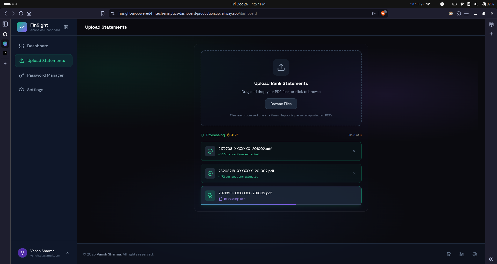
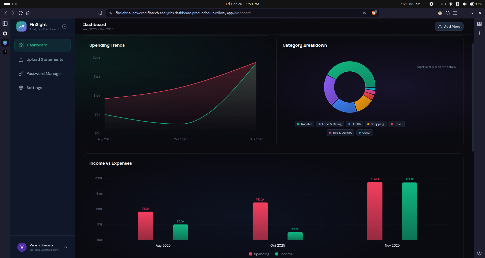

# FinSight — AI-Powered Bank Statement Analytics


A modern fintech dashboard that transforms bank statement PDFs into actionable insights using AI-powered transaction extraction and analysis.

## ⚠️ Note:- 
The current phase of this website is highly optimised for **Kotak Mahindra Bank Statements** only, due to the lack of data. The prediction of other bank statements to work is **undetermined** at the current moment. More bank supports will be added in the future ~

## ✨ Features

- **📄 PDF Upload & Processing** — Upload bank statements (including password-protected PDFs)
- **🤖 AI Transaction Extraction** — Google Gemini AI parses and categorizes transactions automatically
- **📊 Interactive Analytics** — Beautiful charts showing spending trends, income vs expenses, category breakdowns
- **🔐 Secure Authentication** — Google OAuth via Supabase
- **🔑 Password Manager** — Save and manage passwords for encrypted bank statements
- **📱 Responsive Design** — Fully optimized for mobile and desktop

## 🛠️ Tech Stack

| Layer | Technology |
|-------|------------|
| **Frontend** | Next.js 16 (App Router), React, TypeScript |
| **Styling** | Tailwind CSS, Framer Motion |
| **Charts** | Recharts |
| **Backend** | Next.js API Routes |
| **AI** | Google Gemini 2.5 Flash |
| **Auth & Database** | Supabase (PostgreSQL + Auth) |
| **PDF Processing** | pdf-parse, qpdf (for encrypted PDFs) |
| **Deployment** | Railway (Docker) |

## 🚀 Getting Started

### Prerequisites

- Node.js 18+
- Supabase account
- Google Gemini API key

### Installation

```bash
# Clone the repository
git clone https://github.com/ShenLongVansh/FinSight--AI-Powered-Fintech-Analytics-Dashboard
cd FinSight--AI-Powered-Fintech-Analytics-Dashboard

# Install dependencies
npm install

# Set up environment variables
cp .env.example .env.local
# Edit .env.local with your credentials

# Run development server
npm run dev
```

### Environment Variables

```env
NEXT_PUBLIC_SUPABASE_URL=your_supabase_url
NEXT_PUBLIC_SUPABASE_ANON_KEY=your_supabase_anon_key
GEMINI_API_KEY=your_gemini_api_key
ENCRYPTION_KEY=your_32_char_encryption_key
NEXT_PUBLIC_SITE_URL=your_site_url
```

## 📸 Screenshots




*Coming soon*

## 🗺️ Roadmap — Features Coming Soon

- [ ] **Usage Limits & Premium Tier** — Freemium model with Stripe/Razorpay integration
- [ ] **Multi-Bank Support** — Optimized parsing for specific bank formats
- [ ] **Export to CSV/Excel** — Download transaction data
- [ ] **Budget Tracking** — Set spending limits and get alerts
- [ ] **Recurring Transaction Detection** — Identify subscriptions and regular payments
- [ ] **Dark/Light Theme Toggle** — User preference for color scheme

## 📝 License

This project is for portfolio/demonstration purposes.

---

Built with ❤️ by [Vansh Sharma](https://vansharma-portfolio.vercel.app/)
